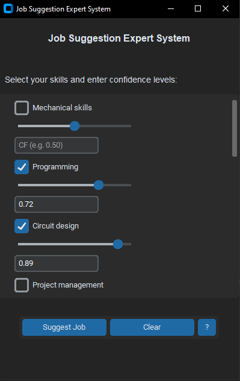

# Rule-Based Expert System using Certainty Factor

## Overview
This project is a Job Suggestion Expert System built using Python and the `customtkinter` library. The system suggests suitable job roles based on user-defined skills and their confidence levels. It uses a set of predefined rules and conditions to evaluate the best job matches (currently only for engineering jobs).

## Usage
- **Select Skills**: Check the boxes next to the skills.
- **Set Confidence Levels**: Use the sliders or input fields to set the confidence level for each selected skill (from 0 to 1).
- **Suggest Job**: Click the "Suggest Job" button to get the most suitable job based on the input.
- **View Detailed Results**: Click on the "Show More" link to see detailed results for all the job suggestions.
- **Clear Selections**: Use the "Clear" button to reset the selections

## Acknowledgments
- Thanks to the creators of customtkinter for providing a great library for building custom GUI applications in Python.
- Special thanks to ChatGPT for the documentation, explanations, and code writing.
